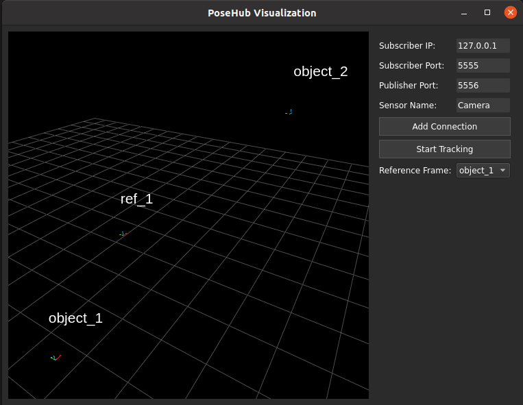

<h1 align="center">PoseHub</h1>
<h4 align="center">Multi-sensor fusion for realtime object tracking task in Augmented Reality</h4>

<p align="center">
<a href="https://www.python.org/"></a>
<a href="ros"></a>
<a href="https://opensource.org/licenses/MIT"></a>
<a href="https://GitHub.com/Naereen/StrapDown.js/graphs/commit-activity"></a>
</div>

PoseHub is a library that manages the transformations of different sensors and objects in the same scene and provides a unified interface for accessing and solving the spatial relationship between frames. For simplification, this package only depends on the [numpy](https://numpy.org/) and [ZeroMQ](https://zeromq.org/) package. The GUI is implemented using [PyQt](https://riverbankcomputing.com/software/pyqt/intro#:~:text=What%20is%20PyQt%3F,and%20contain%20over%201%2C000%20classes.), and the 3D visualization is powered by [PyQtGraph](https://pyqtgraph.readthedocs.io/en/latest/index.html). The idea is inspired by the [tf library](https://wiki.ros.org/tf) and [Open3D](http://www.open3d.org/).

## Installation
Install the dependencies using anaconda.
```bash
python=3.9
zeromq=4.3.5
numpy=1.26.4
open3d=0.18.0
pyqt=5.15.9
pyqt5-sip=12.12.2
pyqtgraph=0.13.7
qt-main=5.15.15
```

Clone the repository to the workspace.
```bash
git clone https://github.com/jmz3/PoseHub.git
```

If you want to use the ros features of the package, you need to build the ros-related packages, namely `posehub_tools`. 
```bash
cd PoseHub
catkin build
```

But if you only want to use the core features of the package, no more ros installation is needed. You can directly use the package by importing the `PoseGraph` class.


## Structure Explained
The package is organized as follows:
```
src
├── posehub_core  # ros-free core implementation of the posehub
└── posehub_tools # synthetic data generator in ros for testing
```


## Usage
Open the GUI by run the main program

```bash
python3 MainApp.py
```

The left side of the GUI shows the real time visualization of the tool/sensor frames.
The right side shows the control panel, which allows the user to add as many sensors as needed.



The program by default loads a localhost config to the control panel. You can always change it to accomendate your sensor interface. 

For example, if you have a sensor that is connected to a PC with `IP 172.0.1.100`. You need to first implement a ZMQ publisher to stream the tracked pose out through any available port, say `5555`. And then fill in the IP address `172.0.1.100` and  Subscriber Port `5555` into the text box on the control panel. The publisher port is for devices with Augmented Reality rendering capabilities. You can put in any available port if the counterparty is just a sensor. The recommended number here to be put for Publisher Port is `5556`, simply 5555+1. 

Once you have configured this sensor, click on `Add Connection` button to confirm and add the sensor into pose graph. 

If you have multiple sensors, you can repeat the step above to add them. Note that the publisher ports have to be unique, duplicated port number for different sensors will cause ZMQ to crash.


The synthetic data generator can create "real" frame motion and noise. To use the synthetic data generator, you can run the following command in the terminal.
```bash
roslaunch posehub_tools synthetic.launch
```
For pure trajectory data, you can run the following command.
```bash
roslaunch posehub_tools fake_tf.launch
```

Here is how the synthetic data looks like in the rviz.


To visualize and save the synthetic trajectory data, use the ros node `posehub_tools/trajectory_visualizer.py`. The following command will save the trajectory data to the `posehub_ros/outputs` folder.
```bash
rosrun posehub_ros VizTrajectory.py
```

## GUI
Old version:

<video controls width="500">
    <source src="docs/scenegraph-oldgui.mp4" type="video/mp4">
    Your browser does not support the video tag.
</video>


New version:

<video controls width="500">
    <source src="docs/scenegraph-newgui.mp4" type="video/mp4">
    Your browser does not support the video tag.
</video>


## Core Features
* Modularized TCP/IP communication for receiving data from different sensors
* Unified Graph structure for storing the transformation between different sensors and objects
* Graph search based spatial transformation solver
* Random synthetic data generator, and noise injection for testing
* 


## Threading and Locking
The communication objects are running in different threads. They are created and started in the main thread. The main thread is responsible for creating and starting the communication objects. The communication objects are responsible for receiving data from the sensors and updating the `PoseGraph` object. The `PoseGraph` object is declared in the main thread so that it can be accessed by all the communication objects. The `PoseGraph` object is locked when it is being updated by the communication objects. The `PoseGraph` object is unlocked when it is being accessed by the main thread.

## Contributors
The package is designed to be used in the [Surgical Tool Tracking using Multi-Sensor System](), the final project of [EN.601.654: Augmented Reality](https://fall2023.jhu-ar.yihao.one/). The contributors of this package are:
* [Jiaming Zhang](https://github.com/jmz3)
* [Hongchao Shu](https://github.com/Soooooda69)
* [Mingxu Liu](https://github.com/JERRY-LIUMX)
