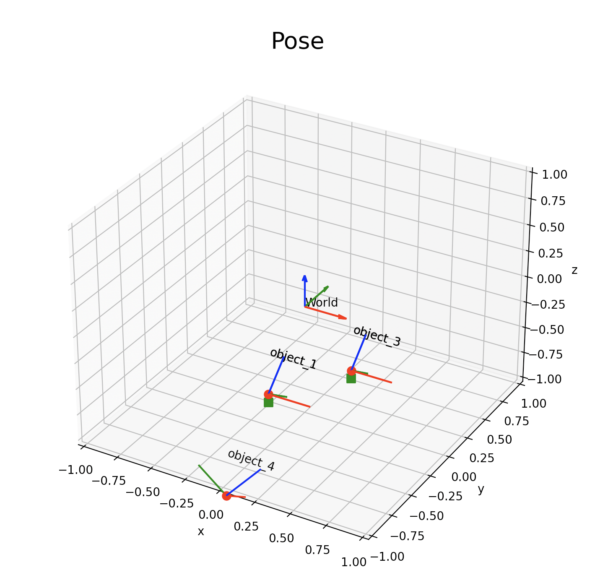

<div align='center'>
    <h1>PoseHub</h1>
    <h4>A library for managing the spatial relationship for realtime object tracking task</h4>
    <a href="https://www.python.org/">
</a>
<a href="https://opensource.org/licenses/MIT">

</a>
<a href="https://GitHub.com/Naereen/StrapDown.js/graphs/commit-activity">

</a>
</div>

PoseHub is a library that manages the transformations of different sensors and objects in the same scene and provides a unified interface for accessing and solving the spatial relationship between frames. For the purpose of simplification, this package only depends on the [numpy](https://numpy.org/) and [matplotlib]() package. The idea is inspired by the [tf library](https://wiki.ros.org/tf) and [Open3D](http://www.open3d.org/).

## Installation

```bash
git clone https://github.com/jmz3/PoseHub.git
```

## Usage
Open a terminal and run the following command to start the ZMQ server.
Note that you need to modify the IP address in the `posehub_main.py` file to the IP address of your sensor (either HoloLens or something else).
```bash
```bash
python3 posehub_main.py
```

If you have multiple sensors, you can copy the following code snippet and modify the args to create multiple communication objects.
```python
args_1 = argparse.Namespace(
    sub_ip=args.sub_ip_1,
    sub_port="5588",
    pub_port="5589",
    sub_topic=[tool_1_id, tool_2_id, tool_3_id],
    pub_topic=[tool_1_id, tool_2_id, tool_3_id],
    sensor_name=sensor_1_id,
)  # args for h1 sensor

# create zmq manager
zmq_manager_1 = ZMQManager(
    sub_ip=args_1.sub_ip,
    sub_port=args_1.sub_port,
    pub_port=args_1.pub_port,
    sub_topic=args_1.sub_topic,
    pub_topic=args_1.pub_topic,
    sensor_name=args_1.sensor_name,
)

# initialize zmq manager
zmq_manager_1.initialize() 

# create pose graph object to store the transformation
pose_graph = PoseGraph()
pose_graph.add_sensor("h1")
```
Since our communication objects are running in different threads, we need to use join the threads by calling the terminate function when we want to exit the program.
```python
# join the threads
zmq_manager_1.terminate()

```

The graph can be visualized by calling the `vis_graph` function in the realtime (max 100Hz). Here is an example of the visualization of the graph. The red and green markers represent the frame is being tracked by different sensors. 




## Core Features
* Modularized TCP/IP communication for receiving data from different sensors
* Unified Graph structure for storing the transformation between different sensors and objects
* Graph search based spatial transformation solver


## Data Structure
Currently, the basic data structure is a customized graph class called `PoseGraph`. It is a directed graph that stores the transformation between nodes. The transformation is represented by a `Pose` class, which contains a 3x3 rotation matrix and a 3x1 translation vector. The `PoseGraph` class provides a unified interface for accessing the transformation between any two nodes. The transformation between two nodes is the product of all the transformations along the path between them. The `PoseGraph` class also provides a unified interface for accessing the transformation between any node and the root node. The transformation between a node and the root node is the product of all the transformations along the path from the node to the root node.

Potential future work: borrow the idea of [networkx](https://networkx.org/) or directly use networkx to implement the graph class if it is more efficient.

## Threading and Locking
The communication objects are running in different threads. They are created and started in the main thread. The main thread is responsible for creating and starting the communication objects. The communication objects are responsible for receiving data from the sensors and updating the `PoseGraph` object. The `PoseGraph` object is declared in the main thread so that it can be accessed by all the communication objects. The `PoseGraph` object is locked when it is being updated by the communication objects. The `PoseGraph` object is unlocked when it is being accessed by the main thread.

## Contributors
The package is designed to be used in the [Surgical Tool Tracking using Multi-Sensor System](), the final project of [EN.601.654: Augmented Reality](). The contributors of this package are:
* [Jiaming Zhang](https://github.com/jmz3)
* [Hongchao Shu](https://github.com/Soooooda69)